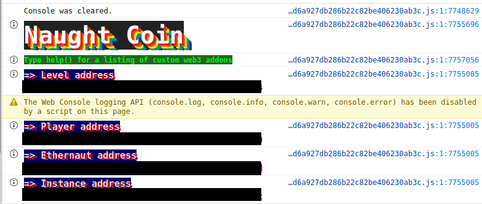
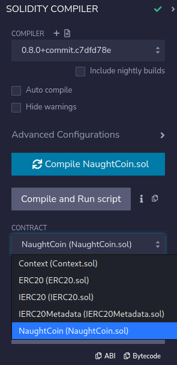
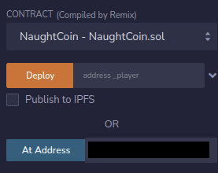
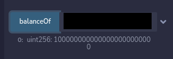
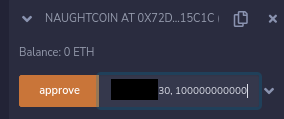
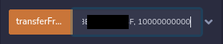
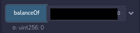

# 15: NaughtCoin :smirk:
The Ethernaut is a Web3/Solidity based wargame inspired by https://overthewire.org, played in the Ethereum Virtual Machine, in which each level is based on a smart contract that needs to be "hacked".

This is a sample walkthrough for the level called "NaughtCoin".

## Setup :beginner:
First off we need a wallet. Get the Metamask Wallet from https://metamask.io/ and choose whichever network works for you ( in my case i will be using Goerli's testnet).
Fund the wallet with some testnet eth by using Alchemy's faucet https://goerlifaucet.com and then click on the button "Get new instance" to deploy the contract.

## Steps for completing the level :zap:
Click on F12 to get on Developer Tools. You will get something like this:

Copy the NaughtCoin.sol contract found before "submit instance" and "get new instance" buttons.

Go on Remix: https://remix.ethereum.org/ and prepare to make some changes in NaughtCoin.sol.

This level asks us to withdraw all the balance down to 0, knowing we have a modifier that doesn't allow us to withdraw any tokens until a 10 years period has passed. 

Let's first on add the missing files that NaughtCoin imports, found on [Openzeppelin's Github account](https://github.com/OpenZeppelin/openzeppelin-contracts/tree/master/contracts):
>- <value> In NaughtyCoin.sol change **"openzeppelin-contracts-08/token/ERC20/ERC20.sol"** to **"./ERC20.sol"**;

In ERC20.sol change these next lines:
>- <value> **"./IERC20.sol"** to **"./IERC20.sol"**;
>- <value> **"./extensions/IERC20Metadata.sol"** to **"./IERC20Metadata.sol"**;
>- <value> **"../../utils/Context.sol"** to **"./Context.sol"**;

And in IERC20Metadata.sol change back this line:
>- <value> **"../IERC20.sol"** to **"./IERC20.sol"**;

Compile the NaughtCoin.sol contract:

Now let's interact with the already deployed contract by using instance's address showed on Developer Tools. Also, don't forget to add your wallet on Environment by selecting "Injected Provider - Metamask".

Let's check our account's balance:

That's a lot of zeros to be withdrawn. To clear the user's balance we have to use the transferFrom function, due to the modifier being applied only on to the other transfer function. 

Before using the transferFrom function, we need to approve the amount of tokens we are going to transfer. Fill the approve function with your account's address and balance:

Now go to the transferFrom function and use as parameters your user's address, sender's address (you can use or create another Metamask account for this) and the balance we are going to transfer:

Check the instance's balance again:

Wow, congrats!! You have managed to withdraw all the tokens and complete this level in process.

Now finish the level by using the submit button at the bottom of the page.

Congrats! See you on to the next level.:wave: